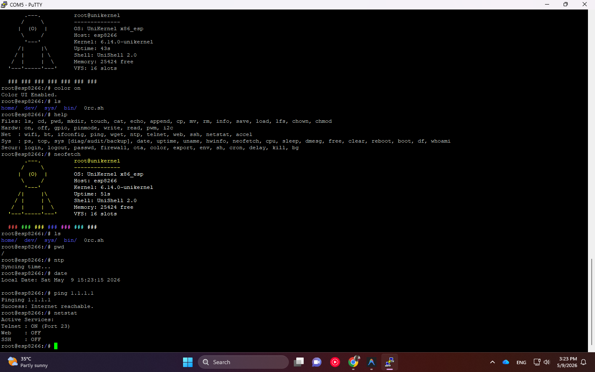

# UniKernel User Manual for ESP8266 , ESP32

UniKernel is a microcontroller-level kernel emulator designed for ESP8266 resource management. It features a Virtual File System (VFS), multitasking task management, and integrated security protocols.

---

## 1. Command Reference

### 1.1 FileSystem Management
| Command | Usage | Description |
| :--- | :--- | :--- |
| `ls` | `ls [-l]` | List files and directories (-l for detailed view). |
| `cd` | `cd [directory]` | Change the current directory. |
| `pwd` | `pwd` | Print the path of the current working directory. |
| `mkdir` | `mkdir [name]` | Create a new directory. |
| `touch` | `touch [name]` | Create a new empty file. |
| `cat` | `cat [filename]` | Display the contents of a file. |
| `echo` | `echo [text] > [file]` | Write text to a file (Overwrites existing content). |
| `append` | `append [file] [text]` | Append text to the end of a file. |
| `cp` | `cp [source] [destination]` | Copy a file to a new location. |
| `mv` | `mv [source] [destination]` | Move or rename a file/directory. |
| `rm` | `rm [name]` | Delete a file or directory. |
| `info` | `info [name]` | Display file properties (Type and Size). |
| `save` | `save` | Persist the VFS state to EEPROM. |
| `load` | `load` | Restore the VFS state from EEPROM. |
| `lfs` | `lfs [ls/format/write]` | Manage the LittleFS persistent flash storage. |
| `alias` | `alias name=cmd` | Create custom command shortcuts (e.g., `alias d=neofetch`). |

### 1.2 System & Security
| Command | Usage | Description |
| :--- | :--- | :--- |
| `login` | `login [password]` | Authenticate to access protected commands. |
| `passwd` | `passwd [new_pass]` | Set/Change the system password. |
| `trigger`| `trigger [cond] [op] [val] [act]` | Intelligent automation (e.g., `trigger vcc < 3000 deepsleep`). |
| `deepsleep`| `deepsleep [sec]` | Enter low-power mode for X seconds. |
| `mqtt` | `mqtt [host] [msg]` | Simulate/Send data to an external IoT Broker. |
| `reboot` | `reboot` | Restart the system. |
| `chown` | `chown [root/guest] [file]` | Change the owner of a file. |
| `chmod` | `chmod [mode] [file]` | Change file permissions (Octal mode). |

### 1.2 Hardware Interface Control
| Command | Usage | Description |
| :--- | :--- | :--- |
| `on` / `off` | `on/off [pin]` | Set digital logic to HIGH or LOW. |
| `write` | `write [pin] [high/low]` | Write a digital output value. |
| `read` | `read [pin]` | Read the digital input value from a pin. |
| `pwm` | `pwm [pin] [0-255]` | Set a Pulse Width Modulation (PWM) signal. |
| `gpio` | `gpio [pin] [action]` | Control GPIO status (on, off, toggle). |
| `pinmode` | `pinmode [pin] [in/out]` | Set the operational mode of a pin (Input/Output). |
| `i2c` | `i2c scan` | Scan the I2C bus for connected device addresses. |

### 1.3 Networking and Communication
| Command | Usage | Description |
| :--- | :--- | :--- |
| `wifi` | `wifi connect [ssid] [pass]` | Configure and establish a WiFi connection. |
| `wifi` | `wifi [scan/status/off]` | Manage WiFi operational status. |
| `ifconfig` | `ifconfig` | Display network configuration (IP, Gateway, MAC). |
| `ping` | `ping [host]` | Test network connectivity to a remote host. |
| `wget` | `wget [url] [filename]` | Retrieve data from the internet via HTTP protocol. |
| `ntp` | `ntp` | Synchronize system time via Network Time Protocol. |
| `telnet` | `telnet [on/off]` | Enable/Disable remote access (Unsafe, Disabled by default). |
| `web` | `web [on/off]` | Enable/Disable the Web Dashboard (Hardened with Firewall). |
| `ssh` | `ssh [on/off]` | Enable/Disable Encrypted Shell (**EC P-256 Elliptic Curve**). |
| `bt` | `bt [on/off]` | Manage Bluetooth status (ESP32 only). |
| `netstat` | `netstat` | Display active network services and ports. |

### 1.4 System Monitor and Management
| Command | Usage | Description |
| :--- | :--- | :--- |
| `hwinfo` | `hwinfo` | Display low-level hardware parameters (Flash Mode, VCC, CPU). |
| `top` | `top` | Real-time monitor for memory and active tasks. |
| `ps` | `ps` | List currently running tasks and processes. |
| `uptime` | `uptime` | Show the total system elapsed time since boot. |
| `date` | `date` | Display the current system date and time. |
| `free` | `free` | Show available heap memory. |
| `cpu` | `cpu [80/160]` | Adjust the CPU clock frequency (MHz) at runtime. |
| `sleep` | `sleep [seconds]` | Enter Light Sleep mode for a specified duration. |
| `reboot` | `reboot` | Perform a system hardware restart. |
| `boot` | `boot [file/list/reset]` | Manage startup boot scripts and profiles. |
| `neofetch` | `neofetch` | Display system information banner. |
| `clear` | `clear` | Clear the terminal screen. |
| `dmesg` | `dmesg` | Display kernel log messages. |
| `df` | `df` | Show filesystem disk space usage. |
| `whoami` | `whoami` | Display current logged-in user. |
| `uname` | `uname` | Show system and kernel information. |

### 1.5 Security and Utilities
| Command | Usage | Description |
| :--- | :--- | :--- |
| `login` | `login [password]` | Authenticate as root (Uses **Salted SHA-256**). |
| `logout` | `logout` | Terminate the current session. |
| `passwd` | `passwd [new_pass]` | Change root password (128-bit entropy salted hash). |
| `firewall` | `firewall allow [IP]` | Whitelist an IP for Shell, Web, and API access. |
| `ota` | `ota on` | Enable wireless firmware updates. |
| `ota` | `ota setpass [pass]` | Set OTA password (**MD5 Hash Storage**). |
| `color` | `color [on/off]` | Enable or disable ANSI terminal colors. |
| `export` | `export key=val` | Set an environment variable. |
| `env` | `env` | List all active environment variables. |
| `sh` | `sh [script_file]` | Execute a batch of shell commands from a file. |
| `cron` | `cron [list/rm ID]` | Manage scheduled tasks. |
| `delay` | `delay [ms]` | Pause execution for specified milliseconds. |
| `kill` | `kill [pid]` | Terminate a background task by PID. |
| `bg` | `bg [blink]` | Start a task in the background. |

---

## 2. Security and Access Protocols

*   **Authentication:** Sensitive commands require root privileges. All passwords are secured with **Salted SHA-256 (16-byte salt)**.
*   **Brute-Force Protection:** Exponential backoff (Cooldown) triggered after failed logins. 5 consecutive fails trigger a **300s system lockout**.
*   **Encrypted Shell (SSH):** Advanced encryption using **Elliptic Curve P-256 (secp256r1)** for fast and secure remote management.
*   **Hardened Firewall:** Whitelist your IP using `firewall allow [IP]`. This protects Serial, Telnet, SSH, and the **Web API/Dashboard**.
*   **OTA Security:** Firmware updates are protected by **MD5 Hashed** credentials. Default: `admin`.
*   **Session Security:** Automatic logout occurs after 5 minutes of inactivity.

## 3. Technical Specifications

*   **Platform:** ESP8266 (NodeMCU / Wemos D1 Mini)
*   **CPU Speed:** 160 MHz (Optimized Default)
*   **Communication:** Serial Baud 115200 / Telnet Port 23 / HTTP Port 80 / SSH Port 22
*   **File System:** Hybrid VFS (RAM-based) + LittleFS (Persistent Flash-based)

---

## 4. Intelligent Automation

### 4.1 Smart Variables
You can use dynamic hardware data in any command by prefixing with `$`:
- `$VCC`: Current battery/input voltage in mV.
- `$TEMP`: Internal system temperature simulation.
- `$RAM`: Remaining free heap memory in bytes.

**Example:** `echo "Power Level: $VCC" > /dev/null`

### 4.2 Smart Triggers
UniKernel can monitor itself and react to environment changes:
- `trigger vcc < 3100 deepsleep` : Sleep if battery is low.
- `trigger ram < 2500 clear` : Free memory buffers if RAM is tight.

---

## 5. Hardware Interface & Recovery

### 5.1 Virtual Devices (`/dev/`)
Access hardware directly via the filesystem:
- `cat /dev/vcc` : Read current voltage.
- `cat /dev/temp` : Read current temperature.
- `cat /dev/led` : Get LED status (0/1).

### 5.2 Physical Reset Button (FLASH/GPIO 0)
Use the physical button on your board to recover access:
1. **Double Click (2x):** Manual Unlock (Resets `loginFailCount`).
2. **Triple Click (3x):** Factory Reset (Clears Password and Fail Count).

---

## 6. External Connectivity (IoT)

### 6.1 MQTT Bridge
To send data to an external server or Home Assistant:
`mqtt 192.168.1.50 "Temperature is $TEMP"`

### 6.2 Remote Control (Web Dashboard)
Access your dashboard at `http://[ESP_IP]`. The Pro Dashboard includes real-time RAM gauges and remote power management tools.

---

## 7. Lightweight UniAccel GPU Acceleration

UniAccel is a distributed computing engine that offloads heavy mathematical and security tasks from the microcontroller to a powerful GPU Host (via `UniAccelHost.py`).

### 7.1 Lightweight UniAccel Command Reference
| Command | Usage | Description |
| :--- | :--- | :--- |
| `accel connect` | `accel connect [IP] [Port]` | Manually connect to a GPU Host. |
| `accel discover` | `accel discover` | Auto-discover Host using mDNS (Zeroconf). |
| `accel research` | `accel research crack [hash] [s] [r]` | Parallel Brute-force Hash Cracking. |
| `accel research` | `accel research prime [s] [r]` | High-speed Prime Number discovery. |
| `accel research` | `accel research match [text] [pat]` | Parallel Pattern Matching in memory. |
| `accel encrypt` | `accel encrypt [text] [key]` | Offload parallel XOR/Rotate encryption. |
| `accel inject` | `accel inject [file.cu]` | JIT-Compile and run custom CUDA code. |
| `accel bench` | `accel bench` | Run a 7-stage GPU Stress Test & Benchmark. |
| `accel status` | `accel status` | Check connection and GPU telemetry. |
| `accel disconnect`| `accel disconnect` | Terminate the accelerator link. |

### 7.2 Lightweight Advanced GPU Kernels
The UniAccel Host supports the following specialized kernels for `gpu_exec`:
- **`render_3d`**: Real-time Raymarching using Signed Distance Fields (SDF) and Metaballs.
- **`vision_filter`**: Parallel image processing (Grayscale conversion and enhancement).
- **`signal_proc`**: Magnitude calculation for high-frequency sensor signal data.
- **`matrix_mul`**: Matrix multiplication for AI Inference and mathematical layers.
- **`pattern_match`**: Parallel scanning for specific data sequences or signatures.
- **`hash_crack`**: Brute-force cracking for MurmurHash3-style mixers.
- **`prime_search`**: Sieve-like prime number search across large ranges.

### 7.3 Setup & Requirements
1.  **Host**: Ensure you have a Windows PC with an NVIDIA GPU and latest drivers.
2.  **Run**: Double-click `UniAccelHost.exe` in the root directory.
3.  **Client**: Ensure ESP32/ESP8266 is on the same WiFi network.
4.  **Connect**: Type `accel discover` or `accel connect [IP]` on the shell.

---

