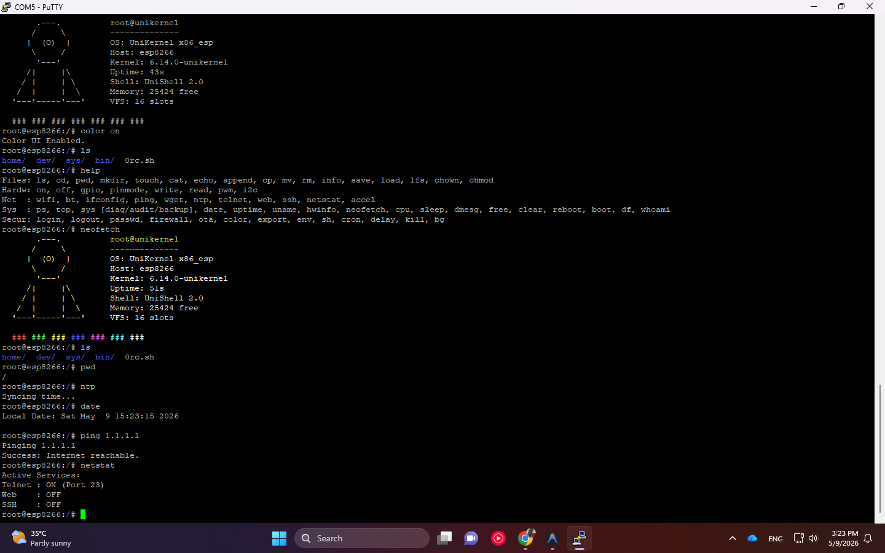

# UniKernel User Manual for ESP8266 , ESP32

UniKernel is a microcontroller-level kernel emulator designed for ESP8266 resource management. It features a Virtual File System (VFS), multitasking task management, and integrated security protocols.

---

## 1. Command Reference

### 1.1 FileSystem Management
| Command | Usage | Description |
| :--- | :--- | :--- |
| `ls` | `ls [-l]` | List files and directories (-l for detailed view). |
| `cd` | `cd [directory]` | Change the current directory. |
| `pwd` | `pwd` | Print the path of the current working directory. |
| `mkdir` | `mkdir [name]` | Create a new directory. |
| `touch` | `touch [name]` | Create a new empty file. |
| `cat` | `cat [filename]` | Display the contents of a file. |
| `echo` | `echo [text] > [file]` | Write text to a file (Quotes are automatically stripped). |
| `append` | `append [file] [text]` | Append text to the end of a file (Quotes are stripped). |
| `cp` | `cp [source] [destination]` | Copy a file to a new location. |
| `mv` | `mv [source] [destination]` | Move or rename a file/directory. |
| `rm` | `rm [name]` | Delete a file or directory. |
| `info` | `info [name]` | Display file properties (Type and Size). |
| `save` | `save` | Persist the VFS state to EEPROM. |
| `load` | `load` | Restore the VFS state from EEPROM. |
| `lfs` | `lfs [ls/format/write]` | Manage the LittleFS persistent flash storage. |
| `alias` | `alias name=cmd` | Create custom command shortcuts (e.g., `alias d=neofetch`). |

### 1.2 System & Security
| Command | Usage | Description |
| :--- | :--- | :--- |
| `login` | `login [password]` | Authenticate to access protected commands. |
| `passwd` | `passwd [new_pass]` | Set/Change the system password. |
| `trigger`| `trigger [cond] [op] [val] [act]` | Intelligent automation (e.g., `trigger vcc < 3000 deepsleep`). |
| `deepsleep`| `deepsleep [sec]` | Enter low-power mode for X seconds. |
| `mqtt` | `mqtt [host] [msg]` | Simulate/Send data to an external IoT Broker. |
| `reboot` | `reboot` | Restart the system. |
| `chown` | `chown [root/guest] [file]` | Change the owner of a file. |
| `chmod` | `chmod [mode] [file]` | Change file permissions (Octal mode). |

### 1.2 Hardware Interface Control
| Command | Usage | Description |
| :--- | :--- | :--- |
| `on` / `off` | `on/off [pin]` | Set digital logic to HIGH or LOW. |
| `write` | `write [pin] [high/low]` | Write a digital output value. |
| `read` | `read [pin]` | Read the digital input value from a pin. |
| `pwm` | `pwm [pin] [0-255]` | Set a Pulse Width Modulation (PWM) signal. |
| `gpio` | `gpio [pin] [action]` | Control GPIO status (on, off, toggle). |
| `pinmode` | `pinmode [pin] [in/out]` | Set the operational mode of a pin (Input/Output). |
| `i2c` | `i2c scan` | Scan the I2C bus for connected device addresses. |

### 1.3 Networking and Communication
| Command | Usage | Description |
| :--- | :--- | :--- |
| `wifi` | `wifi connect <S> [P]` | Connect to SSID with optional Password (supports quotes for spaces). |
| `wifi` | `wifi mode <sta/ap>` | Toggle between Station and Access Point modes. |
| `wifi` | `wifi ap <S> 
` | Setup and enable local Access Point. |
| `waitwifi` | `waitwifi` | Block execution until WiFi is connected (ideal for boot scripts). |
| `ifconfig` | `ifconfig` | Display network configuration (IP, Gateway, MAC). |
| `ping` | `ping [host]` | Real network test with DNS resolution and full statistics. |
| `wget` | `wget [url] [filename]` | Retrieve data from the internet via HTTP protocol. |
| `ntp` | `ntp` | Synchronize system time via Network Time Protocol. |
| `telnet` | `telnet [on/off]` | Enable/Disable remote access (Unsafe, Disabled by default). |
| `web` | `web [on/off]` | Enable/Disable the Web Dashboard (Hardened with Firewall). |
| `bt` | `bt [on/off]` | Manage Bluetooth status (ESP32 only). |
| `netstat` | `netstat` | Display active network services and ports. |

### 1.4 System Monitor and Management
| Command | Usage | Description |
| :--- | :--- | :--- |
| `hwinfo` | `hwinfo` | Display low-level hardware parameters (Flash Mode, VCC, CPU). |
| `top` | `top` | Real-time monitor for memory and active tasks. |
| `ps` | `ps` | List currently running tasks and processes. |
| `uptime` | `uptime` | Show the total system elapsed time since boot. |
| `date` | `date` | Display the current system date and time. |
| `free` | `free` | Show available heap memory. |
| `cpu` | `cpu [80/160]` | Adjust the CPU clock frequency (MHz) at runtime. |
| `sleep` | `sleep [seconds]` | Enter Light Sleep mode for a specified duration. |
| `reboot` | `reboot` | Perform a system hardware restart. |
| `boot` | `boot [filename]` | Set custom boot script (stored in EEPROM). |
| `boot` | `boot reset` | Reset custom boot script to default. |
| `neofetch` | `neofetch` | Display system information banner. |
| `clear` | `clear` | Clear the terminal screen. |
| `dmesg` | `dmesg` | Display kernel log messages. |
| `df` | `df` | Show filesystem disk space usage. |
| `whoami` | `whoami` | Display current logged-in user. |
| `uname` | `uname` | Show system and kernel information. |

### 1.5 Security and Utilities
| Command | Usage | Description |
| :--- | :--- | :--- |
| `login` | `login [password]` | Authenticate as root (Uses **PBKDF2-style 1000 Iterations**). |
| `logout` | `logout` | Terminate the current session. |
| `passwd` | `passwd [new_pass]` | Change root password (**Iterative Hash + Random Salt Rotation**). |
| `firewall` | `firewall allow [IP]` | Whitelist an IP for Shell, Web, and API access. |
| `ota` | `ota on` | Enable wireless firmware updates. |
| `ota` | `ota setpass [pass]` | Set OTA password (**MD5 Hash Storage**). |
| `color` | `color [on/off]` | Enable or disable ANSI terminal colors. |
| `export` | `export key=val` | Set an environment variable. |
| `env` | `env` | List all active environment variables. |
| `sh` | `sh [script_file]` | Execute a batch of shell commands from a file. |
| `cron` | `cron [list/rm ID]` | Manage scheduled tasks. |
| `delay` | `delay [ms]` | Pause execution for specified milliseconds. |
| `kill` | `kill [pid]` | Terminate a background task by PID. |
| `bg` | `bg [blink]` | Start a task in the background. |

---

## 2. Security and Access Protocols

*   **Authentication:** Sensitive commands require root privileges. All passwords are secured with **Iterative SHA-256 (1000 rounds)** providing PBKDF2-level security.
*   **Salt Rotation:** Every password change generates a new 16-byte random salt, stored securely in separate EEPROM sectors.
*   **Brute-Force Protection:** Exponential backoff (Cooldown) triggered after failed logins. 5 consecutive fails trigger a **300s system lockout**.
*   **Physical Protection:** System boot scripts (`[0-2]rc.sh`) can only be modified via **Serial Console** to prevent remote persistent threats.
*   **Hardened Firewall:** Whitelist your IP using `firewall allow [IP]`. This protects Serial, Telnet, and the **Web API/Dashboard**.
*   **OTA Security:** Firmware updates are disabled by default. A **SHA-256 Hashed** password must be configured in EEPROM before OTA can be enabled.
*   **Session Security:** Automatic logout occurs after 5 minutes of inactivity.
*   **Network Hardening:** Telnet and Web services are protected by strict RAM safeguards to prevent OOM-based Denial-of-Service attacks.

## 3. Technical Specifications

*   **Platform:** ESP8266 (NodeMCU / Wemos) & **ESP32 (DevKit / D1)**
*   **CPU Speed:** 160 MHz (Optimized Default)
*   **Communication:** Serial Baud 115200 / Telnet Port 23 / HTTP Port 80
*   **File System:** Hybrid VFS (RAM-based) + LittleFS (Persistent Flash-based)

---

## 4. Intelligent Automation

### 4.1 Smart Variables
You can use dynamic hardware data in any command by prefixing with `$`:
- `$VCC`: Current battery/input voltage in mV.
- `$TEMP`: Internal system temperature simulation.
- `$RAM`: Remaining free heap memory in bytes.

**Example:** `echo "Power Level: $VCC" > /dev/null`

### 4.2 Smart Triggers
UniKernel can monitor itself and react to environment changes:
- `trigger vcc < 3100 deepsleep` : Sleep if battery is low.
- `trigger ram < 2500 clear` : Free memory buffers if RAM is tight.

---

## 5. Hardware Interface & Recovery

### 5.1 Virtual Devices (`/dev/`)
Access hardware directly via the filesystem:
- `cat /dev/vcc` : Read current voltage.
- `cat /dev/temp` : Read current temperature.
- `cat /dev/led` : Get LED status (0/1).

### 5.2 Physical Reset Button (FLASH/GPIO 0)
Use the physical button on your board to recover access:
1. **Double Click (2x):** Manual Unlock (Resets login fail count and cooldown).
2. **Triple Click (3x):** Factory Reset (Clears stored password, salt, and boot settings).

---

## 6. External Connectivity (IoT)

### 6.1 MQTT Bridge
To send data to an external server or Home Assistant:
`mqtt 192.168.1.50 "Temperature is $TEMP"`

### 6.2 Remote Control (Web Dashboard)
Access your dashboard at `http://[ESP_IP]`. The Pro Dashboard includes real-time RAM gauges and remote power management tools.

---

## 7. Lightweight UniAccel GPU Acceleration

UniAccel is a distributed computing engine that offloads heavy mathematical and security tasks from the microcontroller to a powerful GPU Host (via `UniAccelHost.py`).

### 7.1 UniAccel Command Reference
| Command | Usage | Description |
| :--- | :--- | :--- |
| `accel connect` | `accel connect [IP] [Port]` | Connect to a GPU Host (Default port: 81). |
| `accel discover` | `accel discover` | Auto-discover Host via **mDNS (Zeroconf)**. |
| `accel load`     | `accel load [model]`        | Pre-load an AI model (e.g., `TinyLlama/TinyLlama-1.1B-Chat-v1.0`) into GPU VRAM. |
| `accel research` | `accel research crack [hash] [s] [r]` | Parallel Brute-force Hash Cracking (MurmurMix). |
| `accel research` | `accel research rsa` | RSA-2048 high-speed modular exponentiation. |
| `accel encrypt` | `accel encrypt [text] [key]` | Offload complex XOR/Rotate/Shift encryption to GPU. |
| `accel bench` | `accel bench` | Run a **5-stage GPU Performance Analysis**. |
| `accel physics` | `accel physics` | Start **N-Body Gravity Simulation** (ASCII Visual). |
| `accel signal` | `accel signal` | GPU-Accelerated **FFT Signal Analysis**. |
| `accel cluster` | `accel cluster` | View all **Connected Cluster Nodes** metadata. |
| `accel status` | `accel status` | View connection state and real-time **GPU Telemetry**. |
| `accel swap`   | `accel swap out/in [key] [val]` | Offload/retrieve data to **Virtual Swap RAM** on Host. |
| `accel mount`  | `accel mount [path]` | **UniFS Remote Mounting**: Access files from Host `remote_fs`. |
| `accel pipe`   | `accel pipe [model] [data]` | **Edge-AI Pipeline**: Stream data for remote model processing. |
| `accel disconnect`| `accel disconnect` | Close the link to the accelerator host. |

### 7.2 Advanced GPU Kernels
The UniAccel engine leverages CUDA kernels for extreme throughput:
- **`render_3d`**: Real-time Raymarching/SDF rendering (Visualized in ASCII).
- **`matrix_mul`**: Shared-memory optimized Tiled Matrix Multiplication.
- **`hash_crack`**: Brute-force search for target hash values.
- **`rsa_2048`**: RSA-2048 private key operation accelerated via CUDA.
- **`nbody_physics`**: Parallel N-Body gravity simulation for multiple particles.
- **`signal_fft`**: Fast Fourier Transform for real-time sensor data analysis.

### 7.3 AI-Accelerated Chat (`chat` / `accel chat`)
UniKernel now features a dedicated AI Shell powered by TinyLlama on the GPU Host.

- **`chat`**: Enter the interactive AI Chat mode.
- **`accel ask <prompt>`**: Query the AI directly from the system shell.

**Inside AI Chat Mode:**
- **Auto-Interception**: You don't need to prefix commands with `accel ask`. Anything you type is sent to the AI unless it's a shell command like `exit`, `clear`, or `logout`.
- **Premium UI**: AI responses are rendered in stylized cards with ANSI borders and code highlighting.
- Type `exit` or `quit` to return to the system shell.

### 7.4 Performance Benchmarking (`accel bench`)
The built-in benchmark measures:
1.  **Memory Bandwidth**: Host-to-Device and Device-to-Host transfer speeds (GB/s).
2.  **Compute Throughput**: Raw floating-point performance (GFLOPS).
3.  **Shared Memory Latency**: Access speed of on-chip low-latency memory.
4.  **Atomic Operations**: Throughput of synchronized global memory writes.
5.  **Launch Latency**: Driver overhead for triggering kernel execution.

### 7.5 Web Cluster Dashboard
UniAccelHost now includes a high-performance web dashboard for cluster monitoring.
- **Access:** `http://[GPU_HOST_IP]:8080`
- **Features:** Real-time node tracking, request statistics, and comprehensive GPU telemetry (Temp/Load/VRAM).

### 7.6 Security & Transport
- **mDNS Discovery**: Automatically finds `_uniaccel._tcp.local` services.
- **MessagePack Serialization**: Compact binary data exchange.
- **XOR Obfuscation**: All packets are obfuscated with a dynamic XOR key to prevent sniffing.
- **GPU Telemetry**: Real-time monitoring of Temperature, Load, VRAM, and Power.

### 7.5 Setup & Requirements
1.  **Host**: Windows PC with an **NVIDIA GPU** (Compute Capability 3.0+).
2.  **Dependencies**: Install `PyCUDA`, `msgpack`, `zeroconf`, and `pynvml`.
3.  **Run**: Launch `UniAccelHost.py`. It will auto-detect MSVC and CUDA environments.
4.  **Connect**: On UniKernel, type `accel discover` to sync with the host.

### 7.6 Hugging Face CLI (`hf`)
The `hf` command suite allows managing AI model authentication and offline capabilities directly from the ESP8266 shell.

| Command | Usage | Description |
| :--- | :--- | :--- |
| `hf token` | `hf token <token>` | Set your Hugging Face Access Token for gated models (e.g., Gemma). |
| `hf status` | `hf status` | Check if the GPU Host is authenticated and view current status. |
| `hf offline` | `hf offline` | Force the GPU Host into **Offline Mode** (Loads only from local cache). |
| `hf help` | `hf help` | Display the Hugging Face CLI help menu. |

**Handling Gated Models:**
If you receive a `403 Forbidden` or `Gated Repo` error when using `accel load`, follow these steps:
1.  Visit the model page on Hugging Face and click **"Accept License"**.
2.  Generate a **Read Token** in your Hugging Face settings.
3.  On the UniKernel shell, type `hf token your_token_here`.
4.  Retry `accel load`.

**Offline Usage:**
If your GPU Host has restricted internet access, use `hf offline` to prevent the system from trying to connect to the Hugging Face Hub. This ensures the system only attempts to load models that are already stored in the host's local cache.

### 7.7 Advanced Distributed OS Features

UniKernel 2.1 introduces deep integration with the GPU Host to overcome microcontroller hardware limits:

- **Virtual Swap RAM**: When UniKernel detects high memory pressure, it automatically "swaps" non-critical data (like Command History) to the GPU Host's memory, freeing up local heap.
- **UniFS Remote Mounting**: Access a designated `.unifs` folder in your User Home directory (e.g., `C:\Users\Name\.unifs` or `/home/name/.unifs`). Use `accel mount welcome.sh` to read and execute remote scripts as if they were local.
- **Edge-AI Pipeline**: Stream complex sensor or input data to pre-defined AI models on the host. This allows real-time inference (Object detection, Signal classification) without the ESP8266 needing to know the model weights.

---

---

## 8. Advanced Boot Sequence

UniKernel follows a structured multi-script boot sequence to ensure system stability and modularity:

1.  **Standard System Scripts**: The kernel checks for and executes **`0rc.sh`**, **`1rc.sh`**, and **`2rc.sh`** in sequence if they exist in the root directory.
2.  **Custom Boot Script**: Finally, the kernel executes the custom filename stored in EEPROM (configurable via the `boot` command).
3.  **Privilege Elevation**: All scripts executed during the automated boot sequence are granted **Root Privileges** temporarily, regardless of current authentication state.

## 9. System File Protection

To prevent remote attackers from establishing persistence, UniKernel implements **System Immutability** for critical boot files:
- **Protected Files**: `0rc.sh`, `1rc.sh`, `2rc.sh`.
- **Restriction**: These files can **ONLY** be created, modified, or deleted through a **Serial Console session** (Physical access).
- **Remote Access**: Any attempt to modify these files via Telnet or Web Dashboard will be rejected with a `403 Forbidden` error, even if the user is authenticated.
